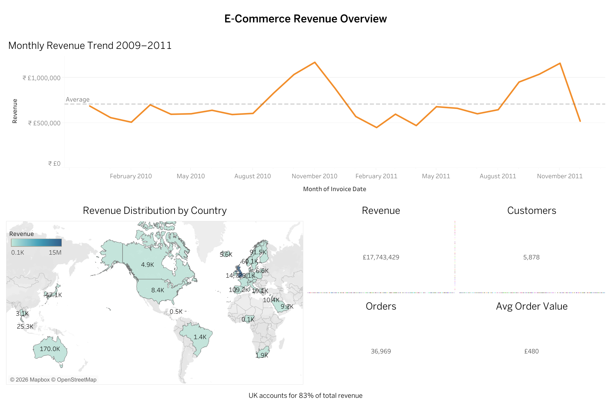

# E-Commerce Customer Revenue & Churn Analysis

## Live Dashboard
🔗 **[View Interactive Tableau Dashboard →](https://public.tableau.com/views/E-CommerceCustomerRevenueChurnAnalysis/D1RevenueOverview?:language=en-US&:sid=&:redirect=auth&:display_count=n&:origin=viz_share_link)**

---

## Overview
End-to-end customer revenue and churn analysis pipeline on **805,549 real retail transactions** from the UCI Online Retail II dataset (2009–2011). Built a complete data pipeline from raw Excel cleaning in Python → cohort analysis and segmentation in SQL → RFM scoring in Python → 4-page interactive Tableau dashboard.

---

## Key Findings

| Finding | Detail |
|---|---|
| Total revenue analysed | £17,743,429 across 805,549 transactions |
| Critical churn window | 77% of customers don't return after first purchase (Month 0→1) |
| Champions insight | 13.2% of customers drive 55.3% of total revenue (£9.82M) |
| At Risk segment | 880 customers with £2.22M in recoverable revenue |
| Lost segment | 734 customers no longer active |
| Top At Risk customer | Customer 12346 — £77,556 revenue, inactive 326 days |

---

## Recommendations

1. **Month-1 Win-Back Campaign** — 77% of customers churn after first purchase; deploy automated follow-up email with personalised offer within 7 days of first purchase
2. **Champions Loyalty Programme** — 774 Champions generate £9.82M (55.3% of revenue); protect this segment with exclusive rewards before they become At Risk
3. **At Risk Re-engagement** — 880 At Risk customers represent £2.22M recoverable revenue; prioritise top 20 by revenue (£548K combined) with 15% loyalty discount

---

## Tech Stack

| Tool | Purpose |
|---|---|
| Python (pandas, matplotlib, seaborn) | Data cleaning, feature engineering, RFM segmentation, EDA |
| SQL (SQLite) | Cohort retention analysis, revenue queries, churn window |
| Tableau Desktop + Public | 4-page interactive dashboard |

---

## RFM Segmentation Results

| Segment | Customers | Revenue | Action |
|---|---|---|---|
| Champions | 774 (13.2%) | £9,818,881 (55.3%) | Protect with loyalty programme |
| Loyal | 1,285 (21.9%) | — | Upsell opportunities |
| Potential Loyalist | 894 (15.2%) | — | Convert to Loyal |
| At Risk | 880 (15.0%) | £2,221,679 | Win-back campaign |
| Lost | 734 (12.5%) | — | Re-acquisition or write-off |
| Others | 1,311 (22.3%) | — | Monitor |

---

## Cohort Analysis

Monthly cohort retention tracked across 24 months (Dec 2009 – Dec 2011):
- **Month 0 → Month 1:** 77% drop-off — critical churn window identified
- **Month 1 onwards:** Retention stabilises at ~20–25%
- **Insight:** Customers who survive past Month 1 become long-term buyers — invest in Month-1 re-engagement

---

## Dashboard Pages

| Page | Description |
|---|---|
| D1 Revenue Overview | Monthly revenue trend, country map, KPI cards |
| D2 Cohort Heatmap | Monthly cohort retention heatmap across 24 months |
| D3 RFM Segments | Customer segment bubble chart, revenue by segment |
| D4 Churn Watchlist | Retention curve, top 20 At Risk win-back priority table |

---

## Feature Engineering

Three RFM metrics calculated per customer from raw transactions:
- `Recency` — days since last purchase (lower = better)
- `Frequency` — unique invoices (higher = better)
- `Monetary` — total revenue generated (higher = better)

Each scored 1–4 using quartile-based `pd.qcut`, then combined into segments using business rules.

---

## Dataset

- **Source:** [UCI Online Retail II Dataset](https://archive.ics.uci.edu/dataset/502/online+retail+ii)
- **Size:** 1,067,371 raw rows → 805,549 after cleaning
- **Period:** December 2009 – December 2011
- **Geography:** UK-based online retailer, 40+ countries
- **Cleaning:** Removed cancellations (Invoice prefix 'C'), null CustomerIDs, zero/negative quantities

---

## Project Structure

    notebooks/rfm_analysis.ipynb         ← Python cleaning, RFM segmentation, EDA
    sql/query1_cohort_retention.sql      ← Monthly cohort analysis
    sql/query2_revenue_by_country.sql    ← Geographic revenue breakdown
    sql/query3_monthly_revenue.sql       ← Revenue trend over time
    sql/query4_churn_window.sql          ← Retention % by month number
    sql/query5_top_customers.sql         ← Top customers by revenue
    screenshots/                         ← Dashboard page screenshots
    assets/rfm_plots.png                 ← Python EDA output

## How to Run

1. Download `online_retail_II.xlsx` from UCI link above
2. Run `notebooks/rfm_analysis.ipynb` top to bottom
3. Open `retail.db` in DB Browser for SQLite → run queries from `sql/`
4. Open Tableau Desktop → connect to `retail_clean.csv`, `rfm_segments.csv`, `churn_window.csv`